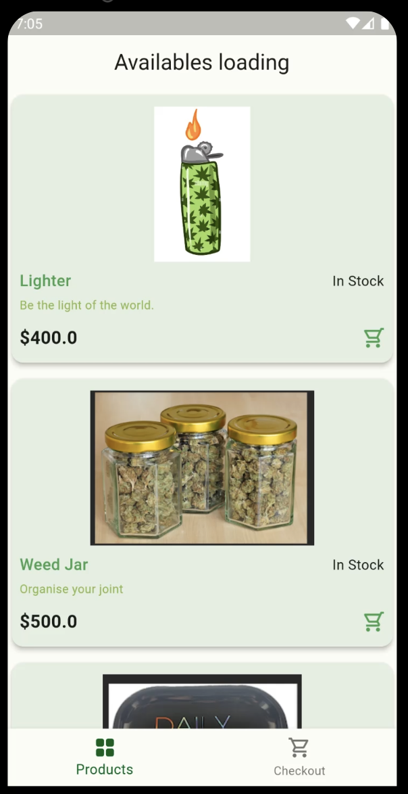
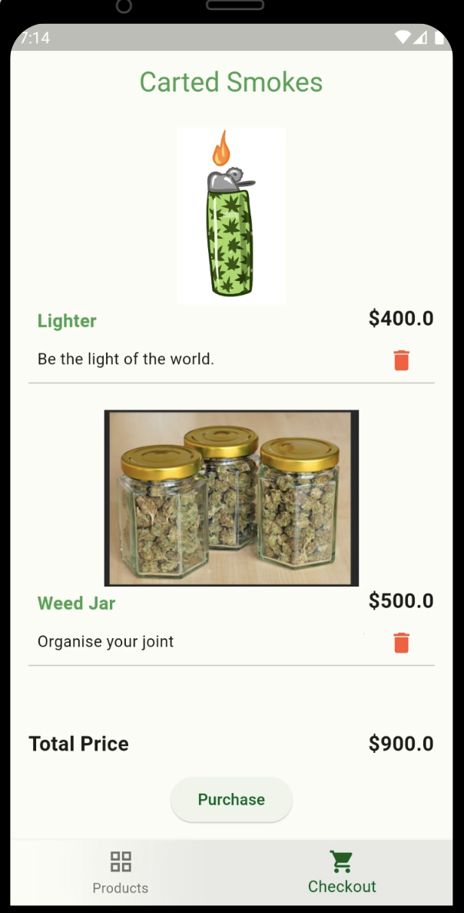

# 420 Shop App

This app fetches products from Timbu and displays the necessary data.

## Getting Started
- Ensure you have Flutter installed
- Run `flutter pub get` after cloning
- Get your credentials (APP_ID, API_KEY,ORGANISATION_ID ) from [Timbu](https://app.timbu.cloud)
- Add the credentials to secret environment for security, [this](https://pub.dev/documentation/dart_define/latest/) explains it better
- Run `flutter run --dart-define-from-file=$pathToYourSecretFile` on your prefered device

[Appetize link](https://appetize.io/app/b_2bydavfggoek4ztefo634xlgx4)

[APK link](https://drive.google.com/file/d/1F2sqqQEay006vspBQ8K5kWYaJG6LPSQ7/view?usp=sharing)

[Demo link](https://drive.google.com/file/d/1LVVsgk2avdK6jL3Ycj0oPK0u0OKQ2bAP/view?usp=drive_link)

## Screenshots

