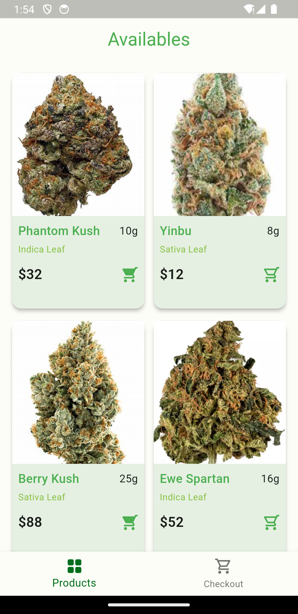
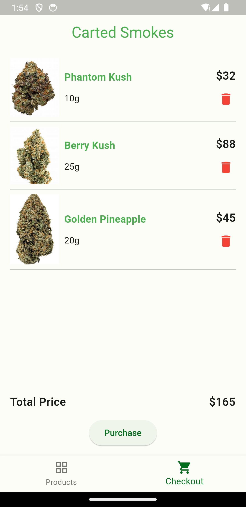
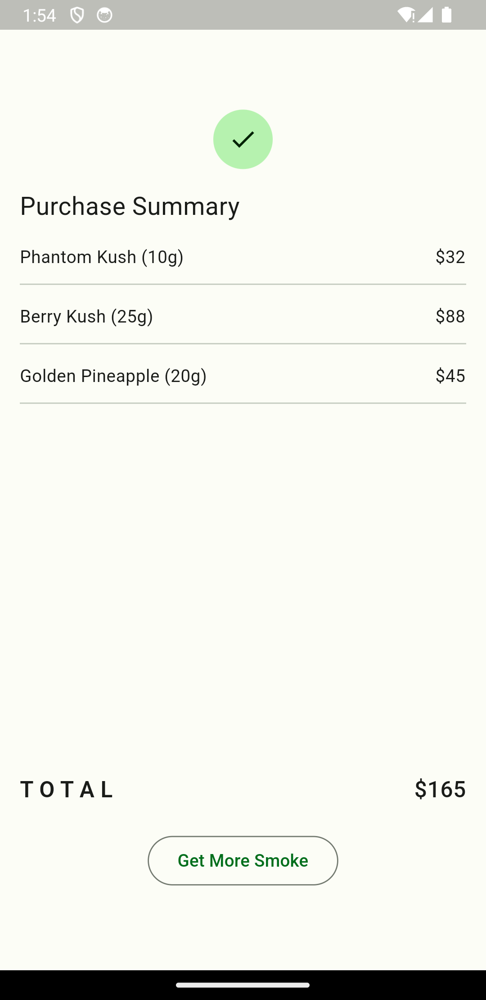

# 420 Shop App

An app for the purchase of natural substance.

## Getting Started
- Ensure you have Flutter installed
- Run `flutter pub get` after cloning
- Run `flutter run` on your prefered device

This project is a starting point for a Flutter application.

[Design inspiration](https://www.freepik.com/free-vector/fashion-shopping-app-interface_9892033.htm#query=shopping%20app%20ui&position=5&from_view=keyword&track=ais_user&uuid=28faa0d6-a484-4cfc-a062-c273dcaecac1)

[Appetize line](https://appetize.io/app/6flxk3ri5dvs2zc42fgmy6esci?device=pixel8pro&osVersion=14.0)

[APK link](https://drive.google.com/file/d/1_9Ltfmi5vIKzPiXFFujmstdJCnKOjRqT/view?usp=drivesdk)

[Demo link](https://drive.google.com/file/d/1FpEz0wPgK5JdRiUb42JjcUu2Qd6eAb4y/view?usp=drivesdk)

## Screenshots

